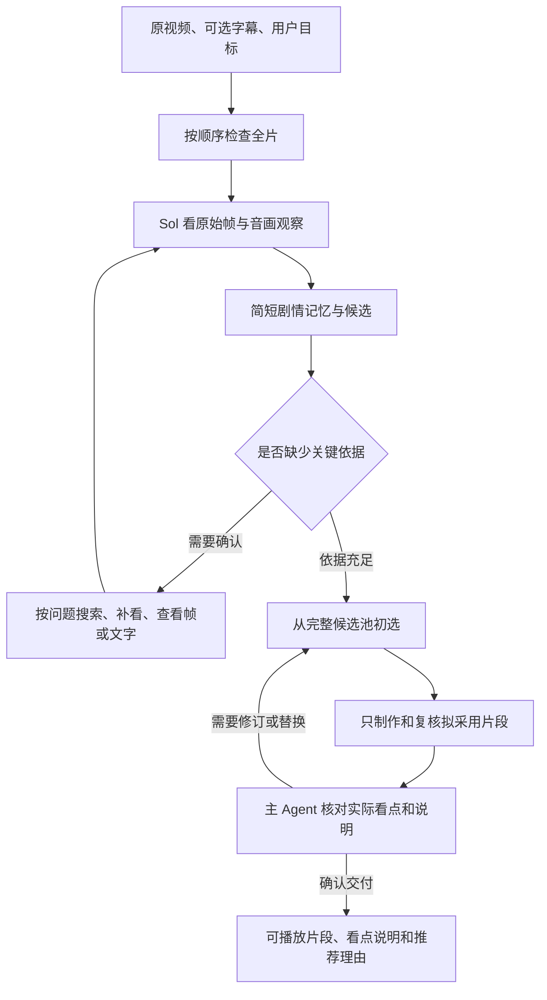

# 短剧高光 Agent 流程

检测入口已使用 `gpt-6.1-sol`，思考强度 `high`。目标是发现正确的独立看点，保留必要内容，尽快交付可播放的粗剪。人类编辑继续采用、删除和调整首尾。

## 从输入到输出

系统连续检查全片，每段都有机会形成候选。分页和边界重叠解决视频传输与跨段台词的问题；材料过大时拆小，不丢弃后续区间。相邻页面的音画观察并发，Sol 按播放顺序处理。发送前同时计算观察文字、原帧、工作状态和工具定义的请求预算，装不下的页面留到下一轮；已经观看并登记的重叠区间可以覆盖尾页，避免重复观看。

Sol 直接看原始帧，Gemini 提供连续动作、声音和台词的观察。Gemini 3.8 Flash 使用 Foxrouter 的 Chat Completions 接口与 `reasoning_effort=high`，观察和复核直接返回受 JSON Schema 约束的结果。真实视频保留声音，原帧由本地按 `VH_VIDEO_FPS` 提取，采样密度不依赖网关转发视频参数。观察、问题、回答与候选统一使用原片秒数，截取片段明确给出原片起止时间。独立观看成片时使用它的播放秒数定位缺陷。每条候选只围绕一个可独立采用的看点，可以共享铺垫并重叠。发现候选后，已有依据直接使用，只补查影响真实性、可懂性或采用决定的问题。

用户提供的字幕按原片时间随对应页面送入，全部相关行进入请求预算，查询记录可以回查。ASR、搜索和本地模型供按需取证。全片音画覆盖确认发现阶段完成，字幕查询和本地预测无需逐条处理才能结束。

## 状态保持简单

| 内容 | 作用 |
| --- | --- |
| 全片进度 | 记录已送达、已看和已登记区间，保证没有漏掉后半段 |
| `story_so_far` | 几句话记住人物关系、当前变化和疑点，支持跨页理解 |
| 候选与粗剪 | 单个看点、原片依据、建议边界、复核结果和最终取舍 |
| 工具记录 | 保存具体问题、原视频来源、答案与检索分页，便于回查和恢复 |

叙事状态在这里就是简短工作记忆。人物的处境、关系、认知和情绪变化用于理解看点；不维护独立的事实表、变化表、问题表或人物时间图，也不让模型重复生成关联字段。观察材料保留完整内容，需要细节时回查原片。

切换到最终选择时，相关原片观察的未确认内容和时间范围继续送入上下文。它们来自已有观察记录，帮助核对独立成片观察里的推测，不增加持久化状态表。

例如，女子指控老人冒充长辈，男子凭药瓶怀疑老人的身份，女子开始惊疑。这几句话已经足够接续剧情。片段描述仍区分人物说法、怀疑与确认；核对依靠原片和独立成片观看。

候选使用稳定 ID，跨页继续补充同一看点。工具提交使用当前版本，避免覆盖错误候选。边界或必要证据修改使该片段的旧复核失效，说明文字修改复用相同成片的核验。完整记录与待执行调用持久保存，会话换段不截断候选池。

## 模型与工具

| 组件 | 职责 |
| --- | --- |
| Sol `high` | 判断剧情、选择工具、修订候选、最终取舍及公开说明 |
| Gemini 视频模型 | 按问题观察原视频，独立检查实际粗剪 |
| Qwen3 VL Embedding 与 Reranker | 按问题定位相关画面和可用台词 |
| PaddleOCR | 原帧或局部区域的文字、位置和置信度 |
| 本地高光模型 | 可选的位置、粗边界和分数线索 |
| FFmpeg 与 FFprobe | 实际帧时间、视频处理和成片导出 |

只有 Sol 运行主 Agent 循环。音画观察和成片复核是明确的服务任务，不另建 Agent 状态。Sol 使用原生 Responses 结构化工具调用，模型配置明确，不自动换模型或协议。

`inspect_video` 带着具体问题补看片段，问题和答案随观察保存。同一视频可以回答不同问题，共享媒体但分别记录结果。`read_frames` 直接看实际帧和可选局部区域；`read_text` 在原图上识别文字，不先把图片交给另一个模型描述一遍。

`search_video` 语义检索原始帧组与可用台词，精确模式查询字幕原文或时间。镜头边界只用于组织检索材料；长镜头继续分段，所有区间都进入索引。Qwen 相关性只用于找材料，返回分页保证后续结果可访问。单视频向量使用 NumPy 精确检索，无需增加向量数据库。

`propose_highlights` 在真实本地 checkpoint 配置后开放，全部预测分页返回，逐条通过视频确认。它提供线索，不决定最终高光价值。

`record_observations` 批量保存已看材料、剧情记忆和候选；`update_event` 修订已有候选；`read_state` 分页回查；`select_highlights` 对完整候选池初选，读取复核结果后确认最终取舍。所有工具随实际可用能力声明。

## 粗剪与取舍

必要证据区间保证铺垫、关键台词或动作、直接反应留在片段里。边界统一由成片模块生成，最终不按几何中点切开重叠。禁止重叠时由 Agent 修订冲突选择。

独立观看实际 MP4，记录呈现的看点、上下文、关键内容、片段焦点和音画问题。主 Agent 结合原片判断问题是否影响交付：核心内容受损时修订，首尾微调交给编辑，开放悬念可以保留。复核提供观察与意见，主 Agent 的最终确认完成交付。时间范围、必要证据、当前版本与媒体完整性由程序检查。修订候选使旧复核失效，再制作和观看该片段。

初选始终看到完整候选池，再应用数量、总时长和重叠约束。系统只制作和复核拟采用片段，主 Agent 核对复核结果与公开说明后确认交付。舍弃项无需修剪，仍可重新采用；更换候选只补做新增片段，其他有效复核继续复用。重复内容可以直接在最终选择时舍弃；确需合并时，保留来源的关键证据。Sol 统一生成公开描述、类型和推荐理由，以实际片段为依据。推荐按采用价值排列，状态为待人工复核，由编辑决定采用、排除或修改。

## 可观测性与验证

`state.json` 保存剧情记忆、候选、原生会话及恢复点；`trace.jsonl` 记录问题、工具结果、模型用量、耗时、是否返回思考内容和错误代码；`progress.json` 提供覆盖率与待处理数量；`selection.json` 保存全部取舍。原始帧使用路径和哈希引用，隐藏推理不写入可读 trace。

最终 MP4 复制到任务目录，并核对它与复核媒体一致。完成检查与取舍后才发布完整结果；中断时明确返回 partial 并保留状态。最终可以不选任何片段。

可复用协议见 [评测与人工复核](evaluation.md)。测试保护全片覆盖、完整候选池、证据保留、修订失效、工具续接、媒体一致性和恢复。真实视频验证分别报告看点质量、完成率、无效重试与耗时。当前标注等待人工确认。

## 代码职责

| 文件 | 职责 |
| --- | --- |
| `pipeline.py` | 装配服务，接收任务并生成公开结果 |
| `prompts.py` | 分析、音画观察、成片检查和最终选择的指令 |
| `runtime/agent.py` | 执行工具、准备材料、调用主模型与保存恢复点 |
| `runtime/contracts.py` | 工具参数、字段含义与调用说明 |
| `runtime/tools.py` | 工具执行、剧情记录、候选和全片进度 |
| `runtime/finalization.py` | 粗边界、证据完整性、复核接收和最终约束 |
| `providers/` | 模型接口、视频观察与复核、检索、OCR 和本地预测 |
| `evaluation.py` | 冻结评测、恢复运行和离线评分 |

提示词描述剪辑目标与取证原则，工具字段说明调用方法，程序检查时间、证据、版本和输出预算。每条初稿从必要信息开始，在一个看点及其直接反应表达清楚后结束。任务上限只限制长度。
