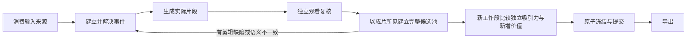

# 视频高光 Agent 架构

项目只有一条检测链路：`HighlightDetectionService.detect()` 装配输入能力，`VideoAgent` 运行 ReAct 循环，`VideoTools` 提交业务状态，最终输出经过实际媒体复核和完整候选池选择的片段。

设计目标是给人类编辑一组高召回、容易判断和修改的候选，不要求 Agent 代替人完成最终剪辑。原视频始终是事实依据；字幕和本地模型扩大召回，不直接决定事件、边界或最终结果。24 秒只是默认可配置上限，片段长度由当前事件所需的铺垫、核心动作和反应决定。

用户得到的核心能力是：发现全片可用看点、按一个看点一条候选拆分、给出可播放初稿和入选理由、对完整候选池排序。用户可以直接采用、排除或调整首尾，不需要先理解 Agent 的内部状态。

## 输入

每个任务接收：

- 原视频及其真实时间轴；
- 可选字幕，或本地可用时按需生成的 ASR；
- 可选本地模型位置线索；
- 用户目标、语言、片段数量、单段时长、总时长和重叠约束。

启用的输入来源必须全部消费完才能选择结果：原视频的每一页都要观看并登记，全文字幕要分页读完，本地模型的完整线索池要载入并逐项核验。没有配置的能力不会产生虚假的必做步骤。

## 状态机

运行时从持久事实计算阶段，不让模型用文字宣告完成。



### 1. 消费输入来源

运行时按时间顺序准备原片页面，并在 token 和请求字节预算内合并相邻页面送入模型。`inspect_interval` 针对具体疑问补看，`search_transcript` 定位台词，`propose_highlights` 读取本地位置线索。

观看视频和登记观察是两个独立的提交点。媒体成功送达后，本轮只暴露与全部已送达 `observation_id` 绑定的 `record_observations`；模型用一次调用登记整批观察，登记前不能检索、改事件或选择。覆盖进度只在登记成功后增加，局部重看使用 `inspect_interval`。

一次模型响应只允许一个工具调用。多调用会整体拒绝，不执行其中任何一项。这保证每一轮都是“观察状态 → 一个动作 → 得到反馈”，不会在同一响应里先登记再继续扫描。

### 2. 建立并解决事件

观察中识别出的候选直接写入 `EventRecord`。一个观察可以包含多个事件，事件也可以跨页面；但一条事件只表达一个能被用户独立采用或舍弃的核心看点。相邻的揭示、回击或反应如果各自成立，分别登记，允许共享铺垫、证据和时间范围。剧情相邻不是合并理由。

- `pending`：需要补看或核对；
- `supported`：已有原视频证据，可以制作片段；
- `rejected`：事件未发生、被证据否定、明确超出用户任务，或已有证据证明无法形成合格片段；
- `merged`：已并入另一个明确事件。

事件的 `required_spans` 只引用实际送达的视频观察，并按原片秒数记录需要保留在成片中的 `setup`、`decisive` 和 `reaction`。补看可以改变判断或首尾位置，不要求把补看的画面也设成必留内容；已有证据仍须通过身份、送达和时间范围校验。更新需要当前版本；事件内容改变后，旧片段和旧选择自动失效。合并必须保留来源事件的决定性证据，时间重叠本身不表示同一事件。

事件核验与最终编辑价值分开。已清楚发生的事件不能因为看点较弱、开放悬念或剧情仍会继续而提前 `rejected`；这些片段完成实际媒体复核后，在全局选择中保留或舍弃。`rejection_category` 使排除理由可校验，其中成片不可行类只有在已经存在超时计划或阻断复核缺陷时才合法。

本地模型只返回位置和分数。每条线索必须由覆盖该范围的实际视频观察确认，再关联事件或排除。推理结果不按最终输出数量截断。

### 3. 生成和复核实际片段

`finalization.py` 是唯一修改最终边界的模块。它从事件的必要证据和建议上下文生成片段，保持所有必要证据完整；超过单段时长时返回不可行状态，由 Agent 修订事件或排除，不做中点切分。

全片取证完成后，运行时确定性地生成所有可行片段。生成的真实媒体分别交给独立上下文并发复核；不同候选之间不共享事件描述或会话。每段成功复核后独立提交，某段失败不会丢失同批成功结果，恢复只继续缺少复核的片段。复核先描述实际看到的事件，再返回相对价值和具体剪辑缺陷。`blocking_issues` 只允许四类问题：

- 缺少理解当前表达所必需的上下文；
- 台词或动作被截断；
- 两个或更多可独立采用的看点被捆绑；
- 音画技术故障。

剧情还在继续、悬念未揭晓、没有后续反转或看点较弱属于价值判断，不阻止片段进入候选池。主 Agent 在 `select_highlights` 中依据实际成片所见，一次完成复核接受、冻结和全局取舍；有问题的片段先补看或修订事件，再重新生成。混合多个独立看点时，Agent 收窄当前事件并分别登记其他看点，不能把它记作不可成片后丢弃。

当前复核不生成无人消费的首尾微调建议。粗边界交给人类编辑；缺少必要内容或发生截断属于阻断缺陷，由 Agent 修正后重新生成和观看。

### 4. 完整候选池选择

所有输入和事件处理完后，当前版本中已完成独立复核且没有阻断缺陷的全部片段直接进入选择状态。每条候选只提供事件 ID、当前版本、实际边界和 `visible_event`。初看描述、早期价值理由和成片分类不进入比较视图。独立复核负责描述事实、分类和具体缺陷；主 Agent 对完整候选池统一生成采用价值 `score` 与取舍理由，避免独立复核预先评价相对价值。

主 Agent 进入选择阶段时，从这些持久事实建立新会话工作段，避免沿用早期猜测和取舍倾向。选择视图不重复塞入完整事件、观察登记和扫描工具结果；完整候选池不截断。运行时保留 `inspect_interval`、`update_event`、`read_state` 和可用的字幕检索，需要修订时可以读取原始事件及当前版本。阶段切换只重建请求上下文，不增加模型调用。进入选择后保持这个工作段。补看、登记和修订只改变当前待办，不退回扫描会话；`repair_events` 提供待修事件的当前版本和缺陷，`inspection_memory` 保留最近 20 条补看结论，更早记录按需回查。这样补看的视频和判断在修订后仍可用于比较。

最终选择给编辑提供覆盖不同看点的初稿，并按采用价值排序。先判断每段自身的吸引力，再比较信息、关系或情绪变化；同一冲突中的不同变化也可以分别采用。没有独立看点的背景、重复表达和不符合用户目标的内容可以舍弃，预算不足时再做价值取舍。关联和重复关系写入简短理由，不使用固定分数门槛。技术复核通过不代表语义身份一定正确，发生冲突时主 Agent 补看或修订，修订后的片段必须重新复核。

`select_highlights` 要求对每个候选恰好提交一次决定。运行时原子接受当前成片复核、冻结全部候选并应用选择。保留项的提交顺序就是价值顺序；舍弃项说明理由，内容重复时可以引用本轮保留的另一项。允许全部舍弃，也不要求填满数量预算。

程序只做确定性校验：候选是否完整、版本是否当前、复核是否通过、重复引用是否有效，以及数量、总时长和重叠约束。预算只在这里应用，完整候选池不会提前截断。

## 工具可用性

模型每轮看到的工具由当前事实决定：

| 状态 | 可执行的关键动作 |
| --- | --- |
| 有刚送达且未登记的视频 | 仅绑定整批 ID 的 `record_observations` |
| 仍有原片页面 | 运行时自动送入下一批；Agent 登记后可按问题细查或检索 |
| 字幕未读完 | 空查询分页调用 `search_transcript` |
| 本地线索未载入或未处理 | `propose_highlights` |
| 事件尚未解决 | 补看、读取或 `update_event`；低价值留到最终选择 |
| supported 事件待成片 | 运行时自动生成并并发独立复核 |
| 复核有缺陷或语义不一致 | `update_event` 或 `inspect_interval` |
| 所有候选复核完成 | 提供完整候选池与 `select_highlights`，保留补看和修订；选择时原子确认、冻结并取舍 |

工具描述告诉模型用途，运行时负责强制状态转换。提示词不重复实现版本、范围、覆盖、预算和恢复规则。

## 会话、持久化与恢复

`state.json` 是业务事实和执行游标的唯一来源。它保存观察、事件、片段、最终选择、原生会话、待执行调用和进展记忆。媒体正文保存在文件中，状态只保存引用，不复制 base64。

同一工作段保留 Gemini 原生 Content、函数调用 ID 和签名。每轮请求都加入最新持久状态，运行时自动生成的片段和独立复核因此也会进入模型上下文。达到上下文或请求字节预算，或首次从分析进入选择时，`Conversation` 从对应的持久事实建立新工作段；旧阶段的孤立工具响应不进入新会话。阶段及待请求上下文一起持久化，恢复未完成请求时仍发送原请求，完成后再刷新状态。需要重新核对的媒体通过原片范围读取。

模型响应先持久化，再执行工具；每个工具结果与业务变化一起提交。中断恢复时，已提交动作不会重做，未执行调用继续处理。暂时性 API 错误只重试完全相同的请求。媒体送达和独立复核一发生就进入进展记忆，后续无效调用不能借用这次变化冒充新进展。

连续无新增信息达到阈值时返回 `partial`。`partial` 的公开 `highlights` 为空，已处理记录保留在状态中供恢复。

## 完成条件

`complete` 同时要求：

1. 所有原片页面已观看并登记；
2. 已启用的全文字幕已经读完；
3. 已启用的本地线索池已经载入，且每条线索已关联或排除；
4. 每个事件都已排除、合并，或形成当前版本的冻结片段；
5. 每个当前候选已有显式选择决定，且预算校验通过。

允许完整结果没有任何高光。完成表示处理协议闭合，语义召回和编辑质量由固定数据集与人工审定评价。

## 输出

- `result.json`：唯一公开结果，schema 2.0；
- `clips.json`：公开片段 ID 到冻结媒体及事件的映射；
- `selection.json`：完整候选池的保留与舍弃理由；
- `state.json`：恢复所需的全部持久状态；
- `progress.json`：覆盖率、待办数量和下一动作；
- `trace.jsonl`：工具、复核、API 使用和失败记录；
- `media/`：观察媒体和最终片段。

`selection.json` 保留 Agent 按采用价值提交的决定顺序；公开片段列表按原片时间排列，便于编辑查看上下文，`score` 表示采用价值。

预览、下载和独立复核使用同一份冻结媒体。人工修改边界会使旧媒体关联失效，再从原片导出。

公开片段的 `description` 和 `highlight_type` 来自同一次独立成片复核；`score` 和 `reason` 来自依据成片事实进行的同一次全局取舍，表示采用价值并说明为何选中。主 Agent 的原始事件描述保留在持久状态中供按需核对，不进入选择视图，也不直接作为交付描述。运行时校验字段来源和状态约束，事实及编辑价值仍需真实视频评测与人工审定。

## 模块职责

```text
pipeline.py                    装配输入能力并生成公开结果
runtime/agent.py               单动作 ReAct 循环、模型请求、独立复核和恢复
runtime/tools.py               状态转换、覆盖、事件版本、工具可用性和完成条件
runtime/contracts.py           严格的模型可见参数
runtime/finalization.py        证据边界、复核契约和完整池选择
runtime/state.py               检索记忆和信息增量
runtime/context.py             原生会话与上下文预算
runtime/evidence.py            原片时间轴、观察媒体和剪辑
providers/retrieval.py         字幕与 ASR 检索
providers/local_proposals.py   本地模型位置线索
```

旧 Scene Map、双 Judge、仲裁、启发式前截断和重叠中点切分已经删除。当前不实现 Agentic RL；可复用 harness 通过冻结任务、源码、输入和标注，对完成率、事件召回、成片召回、最终输出、重复预测与关键证据覆盖进行分阶段比较。面向人类编辑的消融口径见 [Agent 消融协议](agent-ablation.md)。

## 官方接口与工具设计核对（2026-10-01）

Gemini 的多轮函数调用需要保留完整原生响应及 thought signature，官方 SDK 会自动处理；本项目使用 REST，因此在同一会话工作段保留原生 Content，不重建签名片段。首次进入最终选择是新的独立请求段，而修订期间继续当前会话。[Google：Thought signatures](https://ai.google.dev/gemini-api/docs/generate-content/thought-signatures)

Anthropic 的工具设计建议每个工具职责清楚、减少重叠功能，并返回与当前任务相关的信息。本轮将事实复核与完整池价值判断分开，减少选择输入中的早期解释和重复评价，是按这一原则针对当前任务作出的取舍。[Anthropic：Writing effective tools](https://www.anthropic.com/engineering/writing-tools-for-agents)

Google 当前文档已提供 `processing: "agentic"` 视频处理，通过 Interactions API 动态查看时间轴、字幕和帧；短视频的延迟与全帧细节需求也适合静态处理。它是可比较的感知方式，不替代本项目的事件拆分、预算与编辑交付。本项目仍使用当前网关的 `generateContent`，未确认该网关支持 Interactions 和动态视频处理，最终评测没有启用这些能力。后续验证应比较实际事件召回与耗时，不把官方长视频结果移植成本项目的效果。[Google：Video understanding](https://ai.google.dev/gemini-api/docs/video-understanding#agentic-video-understanding)

## 与代表性视频 Agent 的对照（2026-10-01）

对照用于选择机制，不用问答或检索成绩推断短剧剪辑效果。

| 来源 | 已验证的设计机制 | 本项目的取舍 |
| --- | --- | --- |
| [VideoAgent：结构化视频记忆](https://videoagent.github.io/) | 时间事件、对象记忆、语义定位和局部视频问答 | 已保留持久事件与局部补看；短剧候选提取暂不需要对象追踪数据库 |
| [VideoTree](https://arxiv.org/html/2405.19209v3) | 分层表示，按问题相关性加密观察 | 可用于长视频检索和局部观察调度；采样与聚类不能决定是否是高光 |
| [AVI](https://arxiv.org/html/2511.14446v1) | 检索、感知、复查循环；OCR、CLIP 定位等可执行工具 | 复核后保留重看和修订入口；明确视觉细节问题再调用专用感知工具 |
| [NVIDIA VSS](https://docs.nvidia.com/vss/latest/index.html) | 独立视觉服务、embedding 检索、原片查询和验证 | 学习工具职责分离，复用已有视觉能力；不为短剧接入监控与追踪整套基础设施 |
| [Gemini 视频 API](https://ai.google.dev/gemini-api/docs/video-understanding) | 固定采样与动态探索；File API 支持重复使用视频 | 当前短片使用原生音视频与按需补看；文件引用和内置 agentic processing 需先验证当前网关及 API 协议支持 |

据此判断，当前“全片覆盖 → 事件记忆 → 定向补看 → 实际片段复核 → 全池选择”的主线合理。最需要检验的是观察是否捕捉到了关键细节，以及交给编辑的候选是否有用，而不是增加 Agent 数量。

视觉信号应有明确用途：镜头边界用于组织观察和避免在转场处丢失动作；embedding 用于按问题查找相关区间；局部高帧率或 OCR 用于核对短动作和画面文字。它们不直接承担高光价值判断，也不截掉低分区间。现有本地定位模型仍消费 Qwen3-VL 特征、音频特征、能量先验和镜头区间；本次删除的是无人读取的逐帧差分字段和旧召回链路，尚未证明视觉辅助无用。

历史实测和失败分析保留在同目录的 `prompt-v4-evaluation-20260929.md`、`state-v5-evaluation-20260929.md` 和 `editorial-v6-evaluation-20260929.md`。这些报告描述对应旧版本，不作为当前状态机说明。
